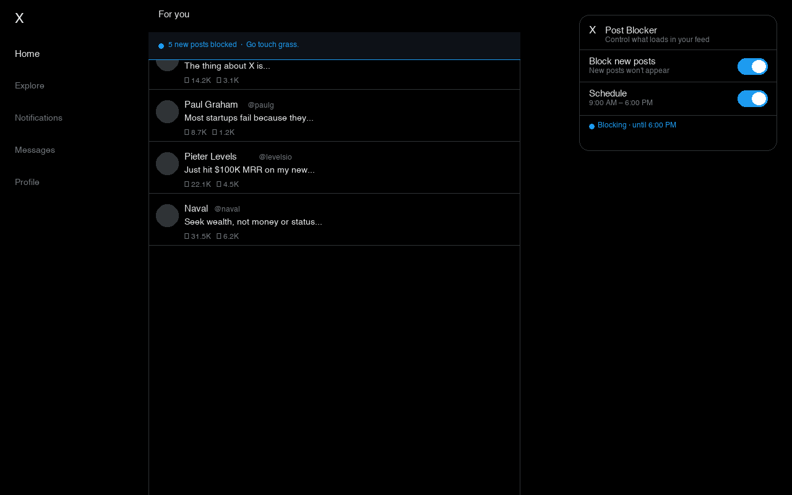

# Twitter New Post Blocker

A Chrome extension that stops new posts from loading in your Twitter/X feed — so you can read without the timeline jumping, and scroll without getting pulled into an endless loop.

---

## What it does

- **Blocks new posts** from appearing while you browse
- **Hides the "X new posts" banner** that tempts you to load more
- **Shows a friendly reminder** when something gets blocked (*"Go touch grass."*)
- **Schedule it** — only block during specific hours, like work hours

---

## Install

### From Chrome Web Store *(coming soon)*
> Link will be added once live.

### Manual install (Developer mode)
1. Download or clone this repo
2. Go to `chrome://extensions` in Chrome
3. Enable **Developer mode** (top right toggle)
4. Click **Load unpacked** → select the repo folder
5. The setup screen opens automatically

---

## How to use

When you first install, a setup screen walks you through three options:

| Option | What happens |
|--------|-------------|
| **Always block** | New posts never load. Maximum peace. |
| **Block on a schedule** | Pick hours — e.g. 9 AM to 6 PM |
| **Keep off** | Posts load normally. Enable later from the icon. |

Click the extension icon any time to change settings.

---

## Screenshots

### Setup screen


### Popup
The extension icon in your toolbar opens a settings popup where you can toggle blocking on/off and adjust your schedule.

---

## Privacy

This extension collects **no data**. Nothing is sent anywhere. The only thing stored is your on/off preference and schedule, saved locally in your browser.

Full privacy policy: [rsk2111999.github.io/twitter-post-blocker-privacy](https://rsk2111999.github.io/twitter-post-blocker-privacy/)

---

## Files

```
├── manifest.json       # Extension config
├── content.js          # Runs on Twitter — blocks posts, shows nudge
├── background.js       # Opens onboarding on first install
├── popup.html/js       # Toolbar popup UI
├── onboarding.html/js  # First-run setup screen
├── icons/              # Extension icons
└── store-assets/       # Chrome Web Store assets
```

---

## Contributing

PRs welcome. Twitter changes its DOM structure occasionally — if selectors break, the fix is usually in `content.js`.

---

## License

MIT
